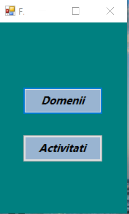
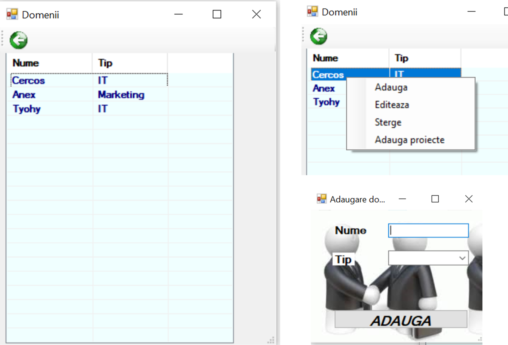
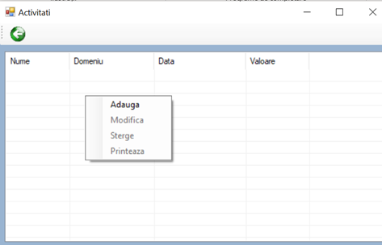
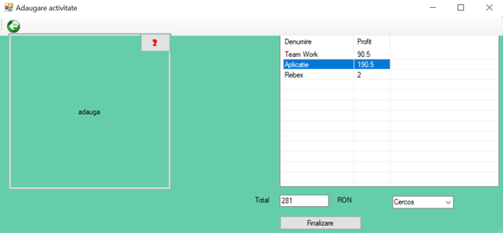
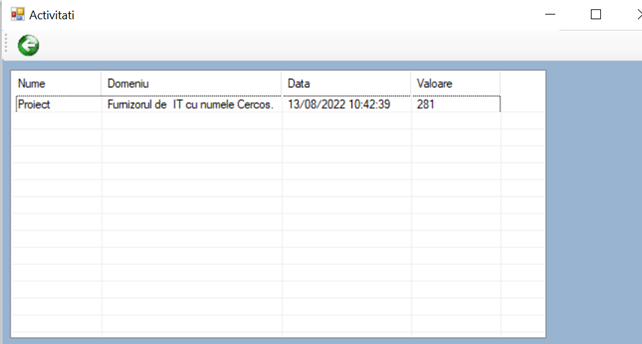
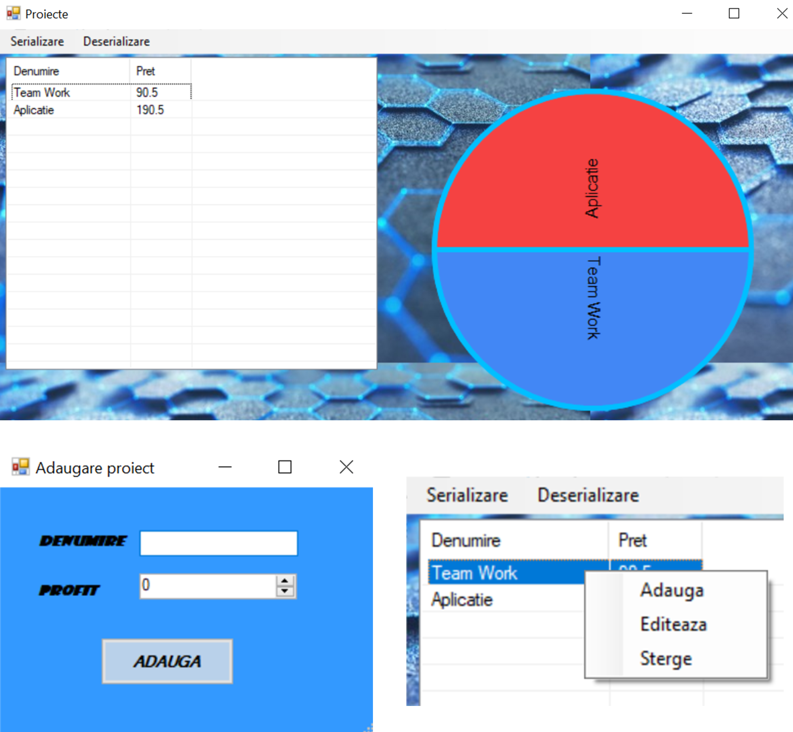

# ActivitiesProjectsManager
C# Desktop Application that stores Domains, Projects and Activities within them. With a simple and minimalist interface, this app was developed as a school project. It concerns a database connection (MySQL) and has features like printable pages and graphics.

First menu:

Adding domains:

Adding an activity:

Form for adding an activity:

After adding the activity:

For an activity, you can assign a project:
